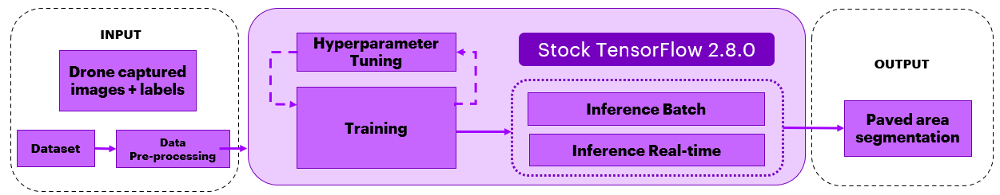
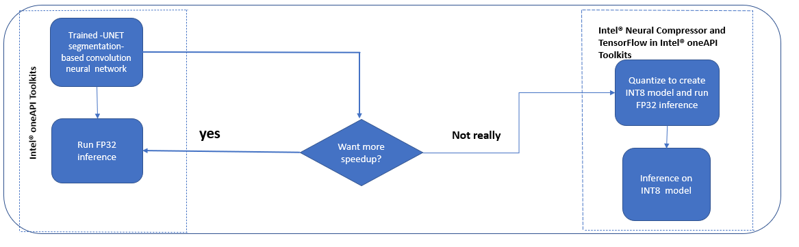
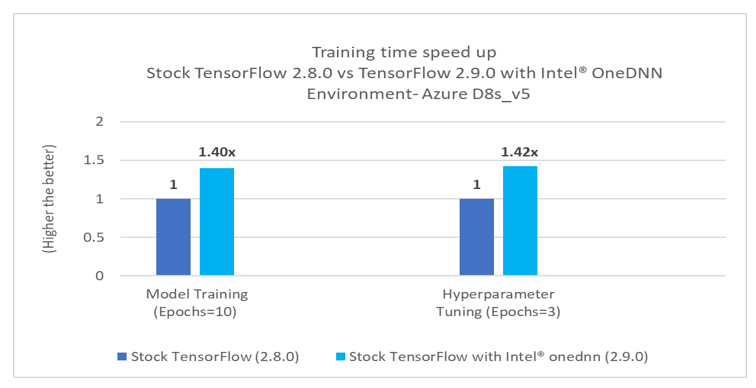
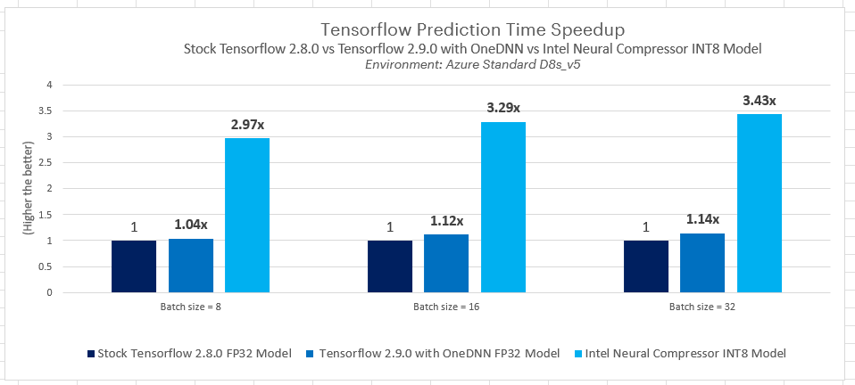

# 人工智能使用 TensorFlow 时在无人机技术中的应用
## 目录 
  

 - 用途 [Purpose](#purpose)
 - 参考解决方案 [Reference Solution](#reference-solution)
 - 参考实现方案  [Reference Implementation](#reference-implementation)
 - 英特尔®优化实现方式 [Intel® Optimized Implementation](#Intel&reg-Optimized-Implementation)
 - 性能观察 [Performance Observations](#performance-observations)

## Purpose  
| 用途  

无人机是无人驾驶飞行器 (UAV) 或无人机系统。从本质上讲，无人机是一种飞行机器人，遥控装置可通过通信功能对其进行远程控制。尽管无人机在城市发展、建筑、基础设施、供应链、物流等领域有着巨大的应用价值，但其安全性却是一个大问题。

无人机在商业上被用作急救车、警察部门的调查工具、高科技摄影，以及房地产、音乐会、体育赛事等的记录设备。本参考套件模型旨在提高无人机自主飞行的安全性，并改善在边缘（运行于基于 CPU 的硬件上）的着陆程序，而无需地面控制人员或现场人类飞行员。

建筑工地上的无人机可用于扫描、记录和绘制地点，或用于建筑物土地测量、跟踪机器、远程监控、建筑工地安全保护、建筑物检查和工人安全保障。然而，无人机坠毁是非常危险的事件，可能造成巨大的破坏。

在公用事业领域，越来越多的塔架、电力线和风力涡轮机需要接受检查，这项艰巨的工作为无人机提供了大显身手的好机会，因为无人机能够实施基于图像的精确检查和诊断，从而取代人工检查。无人机改变了公用事业公司检查和维护人员的工作方式。如果无人机在着陆时发生意外，可能造成资产损坏和人员受伤。

无伤人或损坏财产事件的安全着陆对于无人机在日常生活中的大规模采用至关重要。考虑到无人机着陆的相关风险，铺设无人机着陆专用区域被认为是安全之举。利用英特尔 oneAPI 创建的人工智能模型将铺设好的区域分割为安全着陆区域。

使用英特尔® oneAPI 可以进一步优化人工智能在无人机领域的应用，该工具可以提高计算密集型图像处理的性能，减少训练时间和推理时间，并能够压缩模型，确保其在边缘设备上高效运行，从而扩展复杂模型的使用。经过英特尔® oneDNN 优化的 TensorFlow 可提供额外的优化，进一步提升英特尔® CPU 的性能。

## Reference Solution  
| 参考解决方案  

该参考套件利用英特尔® oneAPI 演示了基于 TensorFlow 的人工智能模型的单向应用，该模型可用于无人机技术，并演示其如何帮助分割铺设区域，从而提高无人机安全着陆的概率。

实验重点是无人机导航检查。因此，本实验旨在对无人机路径周围的铺设区域和不同对象进行分割，以便无人机在铺设区域安全着陆。我们的目标是输入无人机摄像头捕捉的图像，将其传输至语义分割模型（VGG-UNET 架构），以准确识别实体，如铺设区域、人、车、狗等，然后以英特尔技术为基准，对训练、推理（批量和实时）的速度和精度进行测试。在无人机等计算和内存资源较少的边缘设备上部署该模型时，对模型进行量化和压缩，同时实现相同的精度和底层计算资源的高效利用。模型的优化和压缩通过英特尔的 INC 完成。在英特尔® 环境中，使用 Tensorflow 2.8.0 原始版本和带有 oneDNN 的 Tensorflow 2.9.0 实施该参考套件。

## 关键实施细节

- 我们使用 TensorFlow 框架构建支持无人机技术的模型。在本参考套件中，我们强调了使用英特尔® oneAPI AI 分析工具套件与原始版本的区别。
- 在本参考套件中，构建了基于计算机视觉的 VGG-UNET 模型，该模型能够分割供无人机安全着陆的铺设区域。模型的训练时间、推理时间和精度是在原始版本和英特尔 oneAPI 版本上多次运行捕捉的结果。计算多次运行的平均值，并进行了比较。
- 使用英特尔® 神经压缩器对模型进行了量化，表明在英特尔平台上进行的矢量化操作实现了高性能。

## Reference Implementation  
| 参考实现方案  

### 用例：端到端流程



### 预计的输入-输出

| **输入**| **输出**
|:----------:|:----------:
| 图像数据（20 类）| 铺设区域分割

### 参考来源

*数据集：*https://www.kaggle.com/datasets/bulentsiyah/semantic-drone-dataset（本用例为 4 GB 数据集）<br>*案例研究和存储库：*https://www.kaggle.com/code/bulentsiyah/deep-learning-based-semantic-segmentation-keras/notebook

> ***请参阅此数据集适用许可的条款和条件。英特尔® 公司并未拥有本数据集的权利，也不授予其任何权利。***

### 存储库克隆和 Anaconda 安装

```
git clone https://github.com/oneapi-src/drone-navigation-inspection
cd drone-navigation-inspection
```

> 在本参考套件中，实现方案提供了必要的 conda 环境配置来设置软件要求。如需使用这些环境脚本，请先按照以下链接中的说明安装 Anaconda/Miniconda<br>[Anaconda 安装](https://docs.anaconda.com/anaconda/install/linux/)

### 使用和说明

以下是重现该存储库中给出的基准测试结果的步骤

1. 创建执行环境
2. 数据集准备
3. 训练 VGG-UNET 模型
4. 模型推理
5. 使用英特尔® 神经压缩器和基准量化经过训练的模型
6. 观察

### 软件要求

| **封装**| **原始版本 Python**
|:----------|:----------
| Python| Python=3.9.7
| TensorFlow| TensorFlow==2.8.0
| 英特尔® 神经压缩器| *不适用*

### 环境

以下是本模块在 Azure 上使用的开发人员环境。所有观测数据均基于此环境设置。

| **大小**| **CPU 内核数**| **内存**| **英特尔® CPU 产品家族**
|:----------|:----------:|:----------:|:----------:
| *Standard\_D8\_Vs5*| 8| 32GB| ICELAKE

### 解决方案设置

以下文件用于创建如下环境：

| **YAML file**| **环境名称**| **配置**
|:----------:|:----------:|:----------:
| `env/stock/drone-stock.yml`| `drone-stock`| Python=3.9.7 和原始版本 TensorFlow 2.8.0

### 数据集

无人机数据集的像素精确标注侧重于城市场景的语义理解，以提高无人机着陆程序的安全性。该图像是距地面 5 至 30 米位置的鸟瞰图，图中有 20 多座房屋。使用高分辨率照相机拍摄 6000x4000 像素 (24Mpx) 的图像。数据集的复杂度被限制为 20 类，目标输出为铺设区域类。训练集包含 320 幅公开图像，测试集由 80 幅图像组成。在这里，训练数据集和测试数据集的比例为 80:20。

| **用例**| 铺设区域分割
|:----------|:----------
| **相关对象**| 铺设区域
| **大小**| 共计 400 幅标记图像<br>
| **训练：测试比例**| 80:20
| **资料来源**| https://www.kaggle.com/datasets/bulentsiyah/semantic-drone-dataset

> **注**：请参考数据文件夹中的 data.txt 文件下载数据集。

### 训练

VGG-UNET 是一个基于分割的卷积神经网络，是一种分割架构，用于从环境中分割出铺设区域和其他类别。原始版本 TensorFlow v2.8.0 用于在已下载并经过 OpenCV 和 NumPy 预处理的语义无人机数据集上对 VGG-UNET 分割架构进行迁移学习。

> **注**：如果 CV2 依赖项出现"cv2 import \*ImportError: libGL.so.1: 无法打开共享对象文件"或"libgthread-2.0.so.0: 无法打开共享对象文件: 无此类文件或目录"等问题，请参阅已知问题部分。

| **输入图像尺寸**| 416x608（经过预处理的数据）
|:----------|:----------
| **输出模型格式**| TensorFlow 检查点
| **输出**| 铺设区域分割

### 推理

使用原始版本 TensorFlow v2.8.0 在经过训练的模型上实施推理。

#### 1\.环境创建

**设置原始版本 TensorFlow 的环境**<br>请按照下面的 conda 安装命令来设置原始版本 TensorFlow 环境以进行模型训练和预测。

```sh
conda env create -f env/stock/drone-stock.yml
```

*激活原始版本 conda 环境* 使用以下命令激活已创建的环境：

```sh
conda activate drone-stock

```

#### 2\.数据准备

> 在运行 python 训练模块之前，先从文件夹中下载并提取空中语义分割无人机数据集。

提取数据集后的文件夹结构如下所示。

```
- Aerial_Semantic_Segmentation_Drone_Dataset
    - dataset
        - semantic_drone_dataset
            - label_images_semantic
            - original_images
    - RGB_color_image_masks
```

> **注**：有关下载数据集的说明，请参阅数据文件夹中的 data.txt 文件。

> **现在，数据文件夹包含以下结构**<br>data="data/Aerial\_Semantic\_Segmentation\_Drone\_Dataset/dataset/semantic\_drone\_dataset/"

#### 3\.训练 VGG-UNET 模型

运行下面给出的训练模块，使用活动环境开始在验证数据集（训练模型时保留的数据样本，用于估算模型技能）上进行训练和预测。

<br>该模块选择运行训练任务。

```
usage: training.py [-h] [-m MODEL_PATH] [-d DATA_PATH] [-e EPOCHS] [-hy HYPERPARAMS] [-o OUTPATH]

optional arguments:
  -h, --help            show this help message and exit
  -m MODEL_PATH, --model_path MODEL_PATH
                        Please provide the Latest Checkpoint path e.g for "./vgg-unet.1"...Default is None
  -d DATA_PATH, --data_path DATA_PATH
                        Absolute path to the dataset folder containing "original_images" and "label_images_semantic" folders
  -e EPOCHS, --epochs EPOCHS
                        provide the number of epochs want to train
  -hy HYPERPARAMS, --hyperparams HYPERPARAMS
                        enable the hyperparameters for tuning...Default is "0"
  -o OUTPATH, --outpath OUTPATH
                        use 1 to save Intel Model by creating intel folder in model path, for  stock  0

```

**运行训练任务的命令**

> **注**：请确保您从"src"文件夹中运行此命令。

```sh
cd src
python training.py -d ../data/Aerial_Semantic_Segmentation_Drone_Dataset/dataset/semantic_drone_dataset   -e 10  -m ./model -o 0

```

**预期输出** <br>训练完成后，输出的训练模型将以 TensorFlow 检查点格式保存在当前目录下的 model/stock 文件夹中，如下图所示。训练时间（秒）将在训练脚本末尾生成。

```
model/
└------- stock
    ├    ├── vgg_unet_config.json
    │    ├── vgg_unet.index
    │    ├── vgg_unet.data-00000-of-00001
    |    ├── checkpoint
    │  
    │
    └-----intel
```

### Hyperparameter\_tuning

在默认训练中，使用最佳参数实施迁移学习，大幅降低了分类交叉熵损失。后续训练的模型被用作超参数调优的起点，以提高性能。参数搜索空间仅限于下面列出的几个参数，但是用户可以利用这个参考实现方案来提高模型的性能。

**运行超参数调优的命令**

> **注**：请确保您从"src"文件夹中运行此命令。

```sh
python training.py -d ../data/Aerial_Semantic_Segmentation_Drone_Dataset/dataset/semantic_drone_dataset -e 3 -m ./model -hy 1 -o 0
```

```
** Hyperparameters used here are as below **
Dataset remains same with 80:20 split for Training and testing.
batchsize = 4, epochs = 3, steps per epoch = 128

"learning rates"      : [0.001, 0.01, 0.0001]
"optimizers"          : ["Adam", "adadelta", "rmsprop"]
"loss"                : ["categorical_crossentropy"]
```

> 我们建议使用经过常规训练模块训练的模型作为超参数调优的起点。这样就可以确定最佳组合，以提高精度。<br>

> **注**：**超参数调优的最佳组合将在脚本末尾打印出来。可以使用最佳的超参数组合对模型进行更长时间（更多的 epoch）的重新训练，以提高精度。**

**将模型转换为冻结图**

运行转换模块，将 TensorFlow 检查点模型格式转换为冻结图格式。该冻结图后续可用于英特尔® 神经压缩器推理。

```
usage: create_frozen_graph.py [-h] [-m MODEL_PATH] -o OUTPUT_SAVED_DIR

optional arguments:
  -h, --help            show this help message and exit
  -m MODEL_PATH, --model_path MODEL_PATH
                        Please provide the Latest Checkpoint path e.g for "./vgg-unet.1"...Default is None
  -o OUTPUT_SAVED_DIR, --output_saved_dir OUTPUT_SAVED_DIR
                        directory to save frozen graph to.

```

**运行转换任务的命令**

> **注**：请确保您从"src"文件夹中运行此命令。

```sh
 python create_frozen_graph.py -m ./model/stock/vgg_unet --output_saved_dir ./model/stock
```

> 以上转换脚本将把 "frozen\_graph.pb" 保存在当前目录下的 "./model/stock" 文件夹中。

#### 4\.推理

*使用 TensorFlow 冻结图运行推理*

```
usage: run_inference.py [-h] [-m MODELPATH] [-d DATA_PATH] [-b BATCHSIZE]

optional arguments:
  -h, --help            show this help message and exit
  -m MODELPATH, --modelpath MODELPATH
                        provide frozen Model path ".pb" file...users can also
                        use Intel® Neural Compressor INT8 quantized model here
  -d DATA_PATH, --data_path DATA_PATH
                        Absolute path to the dataset folder containing
                        "original_images" and "label_images_semantic" folders
  -b BATCHSIZE, --batchsize BATCHSIZE
                        batchsize used for inference
```

**运行推理任务的命令**

> **注**：请确保您从"src"文件夹中运行此命令。

```sh
python run_inference.py -m ./model/stock/frozen_graph.pb -d ../data/Aerial_Semantic_Segmentation_Drone_Dataset/dataset/semantic_drone_dataset -b 1
```

> 以上推理脚本可使用不同的批次大小运行<br>

**在测试数据集上评估模型**

运行评估模块，找出不同类别的精度得分。

```
usage: evaluation.py [-h] [-m MODEL_PATH] [-d DATA_PATH] [-t MODEL_TYPE]

optional arguments:
  -h, --help            show this help message and exit
  -m MODEL_PATH, --model_path MODEL_PATH
                        Please provide the Latest Checkpoint path e.g for "./vgg-unet.1"...Default is None
  -d DATA_PATH, --data_path DATA_PATH
                        Absolute path to the dataset folder containing "original_images" and "label_images_semantic" folders
  -t MODEL_TYPE, --model_type MODEL_TYPE
                        0 for checkpoint 1 for frozen_graph
```

**运行评估任务的命令**

> **注**：请确保您从"src"文件夹中运行此命令。

```sh

 python evaluation.py -d ../data/Aerial_Semantic_Segmentation_Drone_Dataset/dataset/semantic_drone_dataset -m ./model/stock/vgg_unet -t 0
                                                   or
 python evaluation.py -d ../data/Aerial_Semantic_Segmentation_Drone_Dataset/dataset/semantic_drone_dataset -m ./model/stock/frozen_graph.pb  -t 1
```

## Intel&reg; Optimized Implementation  
optimizing the end-to-end-solution with Intel® oneAPI components  
英特尔® 优化的实现 | 利用英特尔® oneAPI 组件优化端到端解决方案  

### 用例：端到端流程



### 优化的软件要求

| **封装**| **英特尔® Python**
|:----------|:----------
| Python| Python=3.9.7
| TensorFlow| TensorFlow==2.9.0
| 英特尔® 神经压缩器| 英特尔® 神经压缩器==1.12

| **YAML 文件**| **环境名称**| **配置**
|:----------:|:----------:|:----------:
| `env/intel/drone-intel.yml`| `drone-intel`| Python=3.9.7 和英特尔® TensorFlow 2.9.0

### 训练

VGG-UNET 是一个基于分割的卷积神经网络，是一种分割架构，用于从环境中分割出铺设区域和其他类别。经过英特尔® oneDNN 优化的 TensorFlow v2.9.0 用于在已下载并经过 OpenCV 和 NumPy 预处理的语义无人机数据集上对 VGG-UNET 分割架构进行迁移学习。

| **输入图像尺寸**| 416x608（经过预处理的数据）
|:----------|:----------
| **输出模型格式**| TensorFlow 检查点
| **输出**| 铺设区域分割

### 推理

在经过训练的模型上实施推理，

- 需要使用经过英特尔® oneDNN 优化的 TensorFlow v2.9.0
- 英特尔® 神经压缩器

#### 1\.环境创建

\*\*在设置英特尔环境之前，请执行以下命令取消激活现有的原始版本环境，并导航到 cd<installation directory> \*\*

```sh
cd <installation directory>
conda deactivate 
```

**设置经过英特尔® oneDNN 优化的 TensorFlow 的环境**<br>请按照下面的 conda 安装命令来设置经过英特尔® oneDNN 优化的 TensorFlow 环境以进行模型训练和预测。

```sh
cd <installation directory>
conda env create -f env/intel/drone-intel.yml
```

**注**：  如果出现任何关于安装 pycocotools 或 gcc 依赖项的问题，请参考已知问题部分。

**激活英特尔 conda 环境** <br>使用以下命令激活已创建的环境：

```sh
conda activate drone-intel
export TF_ENABLE_ONEDNN_OPTS=1
```

**需要使用经过英特尔® oneDNN 优化的 TensorFlow v2.9.0**

启用英特尔® oneDNN 标记，以整合以下经过英特尔® oneDNN 优化的 TensorFlow 优化。

```
export TF_ENABLE_ONEDNN_OPTS=1
```

#### 2\.数据准备

通过数据文件夹中的 data.txt 文件提到的脚本自动下载数据。在原始版本的数据准备部分已经详细讨论过相同的内容。在执行实验之前，需要一次使用一个文件下载数据。

#### 3\.训练 VGG-UNET 模型

运行下面给出的训练模块，使用活动环境开始训练和预测。

该模块选择运行训练任务。

```
usage: training.py [-h] [-m MODEL_PATH] [-d DATA_PATH] [-e EPOCHS] [-hy HYPERPARAMS] [-o OUTPATH]

optional arguments:
  -h, --help            show this help message and exit
  -m MODEL_PATH, --model_path MODEL_PATH
                        Please provide the Latest Checkpoint path e.g for "./vgg-unet.1"...Default is None
  -d DATA_PATH, --data_path DATA_PATH
                        Absolute path to the dataset folder containing "original_images" and "label_images_semantic" folders
  -e EPOCHS, --epochs EPOCHS
                        provide the number of epochs want to train
  -hy HYPERPARAMS, --hyperparams HYPERPARAMS
                        enable the hyperparameters for tuning...Default is "0"
  -o OUTPATH, --outpath OUTPATH
                        use 1 to save Intel Model by creating intel folder in model path, for stock 0

```

**运行训练任务的命令**

> **注**：请确保您从"src"文件夹中运行此命令。

```sh
python training.py -d ../data/Aerial_Semantic_Segmentation_Drone_Dataset/dataset/semantic_drone_dataset   -e 10  -m ./model -o 1

```

**预期输出** <br>训练完成后，输出的训练模型将以 TensorFlow 检查点格式保存在当前目录下的 model/intel 文件夹中，如下图所示。训练时间（秒）将在训练脚本末尾生成。

```
model/
└------- stock
    ├    
    │  
    │
    └----intel
             ├── vgg_unet_config.json
             ├── vgg_unet.index
             ├── vgg_unet.data-00000-of-00001
             ├── checkpoint
```

### Hyperparameter\_tuning

在默认训练中，使用最佳参数实施迁移学习，大幅降低了分类交叉熵损失。后续训练的模型被用作超参数调优的起点，以提高性能。参数搜索空间仅限于下面列出的几个参数，但是用户可以利用这个参考实现方案来提高模型的性能。

**运行超参数调优的命令**

> **注**：请确保您从"src"文件夹中运行此命令。

```sh
python training.py -d ../data/Aerial_Semantic_Segmentation_Drone_Dataset/dataset/semantic_drone_dataset -e 3 -m ./model -hy 1 -o 1
```

```
Hyperparameters used here are as below
Dataset remains same with 80:20 split for Training and testing.
batchsize = 4, epochs = 3, steps per epoch = 128

"learning rates"      : [0.001, 0.01, 0.0001]
"optimizers"          : ["Adam", "adadelta", "rmsprop"]
"loss"                : ["categorical_crossentropy"]
```

> 我们建议使用经过常规训练模块训练的模型作为超参数调优的起点。这样就可以确定最佳组合，以提高精度。<br>

> **注**：**超参数调优的最佳组合将在脚本末尾打印出来。可以使用最佳的超参数组合对模型进行更长时间（更多的 epoch）的重新训练，以提高精度。**

**将模型转换为冻结图**

运行转换模块，将 TensorFlow 检查点模型格式转换为冻结图格式。该冻结图后续可用于英特尔® 神经压缩器推理。

```
usage: create_frozen_graph.py [-h] [-m MODEL_PATH] -o OUTPUT_SAVED_DIR

optional arguments:
  -h, --help            show this help message and exit
  -m MODEL_PATH, --model_path MODEL_PATH
                        Please provide the Latest Checkpoint path e.g for "./vgg-unet.1"...Default is None
  -o OUTPUT_SAVED_DIR, --output_saved_dir OUTPUT_SAVED_DIR
                        directory to save frozen graph to.

```

**运行转换任务的命令**

> **注**：请确保您从"src"文件夹中运行此命令。

```sh
 python create_frozen_graph.py -m ./model/intel/vgg_unet --output_saved_dir ./model/intel
```

> 以上转换脚本将把 "frozen\_graph.pb" 保存在当前目录下的 "./model/intel" 文件夹中。

#### 4\.推理

使用 TensorFlow 冻结图运行推理

```
usage:run_inference.py [-h] [-m MODELPATH] [-d DATA_PATH] [-b BATCHSIZE]

optional arguments:
  -h, --help            show this help message and exit
  -m MODELPATH, --modelpath MODELPATH
                        provide frozen Model path ".pb" file...users can also
                        use Intel® Neural Compressor INT8 quantized model here
  -d DATA_PATH, --data_path DATA_PATH
                        Absolute path to the dataset folder containing
                        "original_images" and "label_images_semantic" folders
  -b BATCHSIZE, --batchsize BATCHSIZE
                        batchsize used for inference
```

**运行推理任务的命令**

> **注**：请确保您从"src"文件夹中运行此命令。

```sh
python run_inference.py -m ./model/intel/frozen_graph.pb -d ../data/Aerial_Semantic_Segmentation_Drone_Dataset/dataset/semantic_drone_dataset -b 1
```

> 在英特尔® 环境下，上述推理脚本可使用不同的批次大小运行<br>相同脚本可用于对英特尔® 神经压缩器 INT8 量化模型进行基准测试。有关更多详细信息，请参阅英特尔® 神经压缩器量化部分。<br>通过使用不同的批次大小，可以观察到在英特尔® 环境中使用经过英特尔® oneDNN 优化的 Tensorflow 所实现的性能提升。<br>运行该脚本可记录多次试验并计算平均值。

**在测试数据集上评估模型**

运行评估模块，找出不同类别的精度得分。

```
usage: evaluation.py [-h] [-m MODEL_PATH] [-d DATA_PATH] [-t MODEL_TYPE]

optional arguments:
  -h, --help            show this help message and exit
  -m MODEL_PATH, --model_path MODEL_PATH
                        Please provide the Latest Checkpoint path e.g for "./vgg-unet.1"...Default is None
  -d DATA_PATH, --data_path DATA_PATH
                        Absolute path to the dataset folder containing "original_images" and "label_images_semantic" folders
  -t MODEL_TYPE, --model_type MODEL_TYPE
                        0 for checkpoint 1 for frozen_graph

```

> **注**：请确保您从"src"文件夹中运行此命令。

**运行评估任务的命令**

```sh
  python evaluation.py -d ../data/Aerial_Semantic_Segmentation_Drone_Dataset/dataset/semantic_drone_dataset -m ./model/intel/vgg_unet -t 0                         
                                                or
  python evaluation.py -d ../data/Aerial_Semantic_Segmentation_Drone_Dataset/dataset/semantic_drone_dataset -m ./model/intel/frozen_graph.pb  -t 1

```

> 相同脚本可用于对英特尔® 神经压缩器 INT8 量化模型进行评估。有关更多详细信息，请参阅英特尔® 神经压缩器量化部分。<br>

#### 5\.使用英特尔® 神经压缩器量化经过训练的模型

英特尔® 神经压缩器用于将 FP32 模型量化为 INT8 模型。这里使用优化的模型进行评估和时间分析。英特尔® 神经压缩器支持多种优化方法。在这里，我们使用训练后量化方法对 FP32 模型进行量化。

*步骤 -1：将 FP32 模型转换为 INT8 模型*

```
usage: neural_compressor_conversion.py [-h] [-m MODELPATH] [-o OUTPATH] [-c CONFIG] [-d DATA_PATH] [-b BATCHSIZE]

optional arguments:
  -h, --help            show this help message and exit
  -m MODELPATH, --modelpath MODELPATH
                        Model path trained with TensorFlow ".pb" file
  -o OUTPATH, --outpath OUTPATH
                        default output quantized model will be save in ./inc_compressed_model/output.pb
  -c CONFIG, --config CONFIG
                        Yaml file for quantizing model, default is "./deploy.yaml"
  -d DATA_PATH, --data_path DATA_PATH
                        Absolute path to the dataset folder containing "original_images" and "label_images_semantic"
                        folders
  -b BATCHSIZE, --batchsize BATCHSIZE
                        batchsize for the dataloader....default is 1
```

**运行 neural\_compressor\_conversion 的命令**

**注：**在运行之前激活英特尔® 环境，确保您从'src/intel\_neural\_compressor'文件夹中运行此命令。

```sh
cd src/intel_neural_compressor
python neural_compressor_conversion.py -d ../../data/Aerial_Semantic_Segmentation_Drone_Dataset/dataset/semantic_drone_dataset -m  ../model/intel/frozen_graph.pb -o  ../model/inc_compressed_model/output

```

> 优化的模型默认将保存在 `../model/inc_compressed_model` 文件夹中：`output.pb`

*步骤 -2：使用量化的模型进行推理*

```
usage: run_inference.py [-h] [-m MODELPATH] [-d DATA_PATH] [-b BATCHSIZE]

optional arguments:
  -h, --help            show this help message and exit
  -m MODELPATH, --modelpath MODELPATH
                        provide frozen Model path ".pb" file...users can also
                        use Intel® Neural Compressor INT8 quantized model here
  -d DATA_PATH, --data_path DATA_PATH
                        Absolute path to the dataset folder containing
                        "original_images" and "label_images_semantic" folders
  -b BATCHSIZE, --batchsize BATCHSIZE
                        batchsize used for inference
```

*实时运行推理任务的命令 `(batchsize =1)`*

```sh
cd <installation directory>/src
 python run_inference.py -m ./model/inc_compressed_model/output.pb -d ../data/Aerial_Semantic_Segmentation_Drone_Dataset/dataset/semantic_drone_dataset  -b 1
```

> 使用 `-b` 进行测试，支持不同的批次大小（如 `-b 10`）

*第 3 步：对量化模型进行评估*

```
usage: evaluation.py [-h] [-m MODEL_PATH] [-d DATA_PATH] [-t MODEL_TYPE]

optional arguments:
  -h, --help            show this help message and exit
  -m MODEL_PATH, --model_path MODEL_PATH
                        Please provide the Latest Checkpoint path e.g for "./vgg-unet.1"...Default is None
  -d DATA_PATH, --data_path DATA_PATH
                        Absolute path to the dataset folder containing "original_images" and "label_images_semantic" folders
  -t MODEL_TYPE, --model_type MODEL_TYPE
                        0 for checkpoint 1 for frozen_graph

```

> **注**：请确保您从"src"文件夹中运行此命令。

**运行评估任务的命令**

```sh

python evaluation.py -d ../data/Aerial_Semantic_Segmentation_Drone_Dataset/dataset/semantic_drone_dataset -m ./model/inc_compressed_model/output.pb  -t 1
```

## Performance Observations   
| 性能观察  

本部分介绍了本模型构建中原始版本 TensorFlow 2.8.0 和经过英特尔® oneDNN 优化的 TensorFlow 2.9.0 之间的训练时间和推理时间比较。

### 训练和超参数调优基准测试结果



<br>**要点**<br>与原始版本 TensorFlow 2.8.0 相比，带有英特尔® oneDNN 的 TensorFlow 2.9.0 在常规模型训练中可将训练速度提高 1.4 倍，在超参数调优训练中可将速度提高 1.42 倍。

### 原始版本 TensorFlow2.8.0 FP32 模型、带有 OneDNN 的 TensorFlow2.9.0 FP32模型与英特尔® 神经压缩器 INT8 模型之间的推理基准测试结果对比。



<br>要点<br>

- 相比于原始版本 TensorFlow 2.8.0 FP32 模型，带有 oneDNN 的 TensorFlow 2.9.0 FP32 模型可将批量预测速度提升高达 1.14 倍。
- 相比于原始版本 TensorFlow2.8.0 FP32 模型，英特尔® 神经压缩器的量化技术可将批量预测速度提升高达 3.43 倍。在批量较大时，原始版本 Tensorflow 2.8.0 会发生错误。
- FP32 模型量化后，两个阶段的精度下降仅为 0.001%。
- 模型占用空间从 47 MB 减少到 12 MB（压缩了约 75%）

## 结论

为构建用于无人机着陆的**铺设区域分割模型**，机器学习开发人员将需要对大量数据集进行模型训练，并更频繁地运行推理。加速训练的能力将有助于他们提高训练频次和精度。除训练之外，更快的推理速度将帮助他们在实时场景中更频繁地运行预测。该参考套件实现方案为无人机安全着陆用例提供了铺设区域分割模型的性能优化指南，可轻松扩展到类似用例。

### 通知和免责声明

实际性能受使用情况、配置和其他因素的差异影响。更多信息请访问[性能指数网站](https://edc.intel.com/content/www/us/en/products/performance/benchmarks/overview/)。性能结果基于截至配置中所示日期的测试，可能不会反映所有公开可用的更新。  详情请参阅配置信息披露。  没有任何产品或组件是绝对安全的。具体成本和结果可能不同。英特尔技术可能需要启用硬件、软件，或激活服务。<br>©英特尔公司版权所有。  英特尔、英特尔标识以及其他英特尔商标是英特尔公司或其子公司在美国和/或其他国家的商标。  其他的名称和品牌可能是其他所有者的资产。

## 附录

### **实验设置**

- 测试实施时间：2022 年 12 月
- 测试实施者：英特尔公司
- 配置详细信息：Azure Standard\_D8\_Vs5 （英特尔® 至强® 铂金 8370C CPU @ 2.80Ghz），单插槽，每插槽 4 核，每核 2 个线程，启用睿频，总内存：32 GB，操作系统：Ubuntu 20.04，核心：Linux 5.13.0-1031-azure，软件：Tensorflow 2.9、Tensorflow 2.8、英特尔® 神经压缩器 1.12

| 优化：| **描述**
|:----------|:----------
| 平台| Azure Standard D8v5：英特尔® 至强® 铂金 8370C (Ice Lake) @ 2.80GHz，4 个 vCPU，32GB 内存
| 操作系统| Ubuntu 20.04
| 硬件| CPU
| 软件| 面向 Tensorflow v2.9.0 的英特尔® oneAPI 优化，英特尔® 神经压缩器 v1.12
| 您将学到的知识| 英特尔® oneAPI 相对于原始版本的性能优势

### 已知问题

1. 环境创建问题：无法为 pycocotools 构建 wheel
   
   **问题：**使用 `drone-intel` 创建英特尔环境时
   
   ```
   ERROR: Could not build wheels for pycocotools, which is required to install pyproject.toml-based projects
   ```
   
   **解决方案：**
   
   安装 gcc。  对于 Ubuntu，情况将是：
   
   ```bash
   apt install gcc
   ```

2. ImportError: libGL.so.1: 无法打开共享对象文件：没有此类文件或目录
   
   **问题：**使用 `training.py` 训练模型时
   
   ```
   ImportError: libGL.so.1: cannot open shared object file: No such file or directory
   or
   libgthread-2.0.so.0: cannot open shared object file: No such file or directory
   ```
   
   **解决方案：**
   
   安装 libgl11-mesa-glx 和 libglib2.0-0 库。对于 Ubuntu，情况将是：
   
   ```bash
   sudo apt install libgl1-mesa-glx
   sudo apt install libglib2.0-0
   ```
